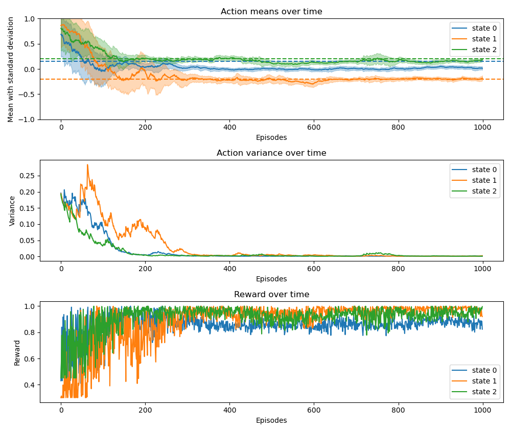

# Implementaton of Continuous Action Learning Automata (CALA)

This project implements Continuous Action Learning Automata (CALA) to learn
an arbitrary set of actions for n-states. CALA is an on-policy Reinforcement 
Learning technique popular for solving stochastic optimization problems. 
For detailed formulations, see Reference 1.

# Results

Below is a plot demonstrating performance for an n=3 state space with a learning rate of 0.1. 
Actions are constrained between -1 and 1.
Note that the means converge to the correct values, variance decreases over time, and the rewards increase.




# References

1. Beigy, H., Meybodi, M.R. (2003). A New Continuous Action-Set Learning Automaton for Function Optimization. In: Yazıcı, A., Şener, C. (eds) Computer and Information Sciences - ISCIS 2003. ISCIS 2003. Lecture Notes in Computer Science, vol 2869. Springer, Berlin, Heidelberg. [https://doi.org/10.1007/978-3-540-39737-3_119](https://link.springer.com/chapter/10.1007/978-3-540-39737-3_119#citeas)
